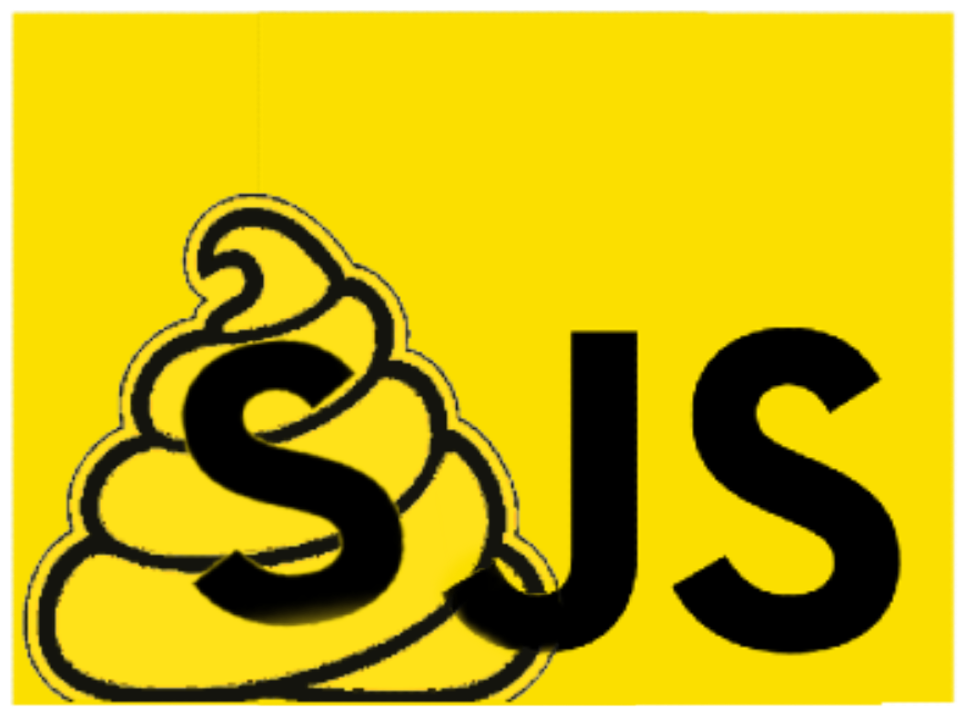

# SJSInterpreter

The shitty interpreter for the Shitty javascript language! A language that isn't javascript at all!

## __Install__
**To install:**  
    1. Essential files are all in **/Interpreter**  
    2. Create a new file and import the **_Interpreter** class  
    3. Create a variable with the object and pass in the file path  
         e.g `const I = new _Interpreter("SJS programs/test.sjs")`  
    4. Use `I.runProgram()` to run your code!  

### __Tutorial & Examples__

There is a tutorial file and example scripts found in the **SJS programs** folder such as:
> * tutorial.sjs
> * fizzbuzz.sjs
> * bouncing ball.sjs
